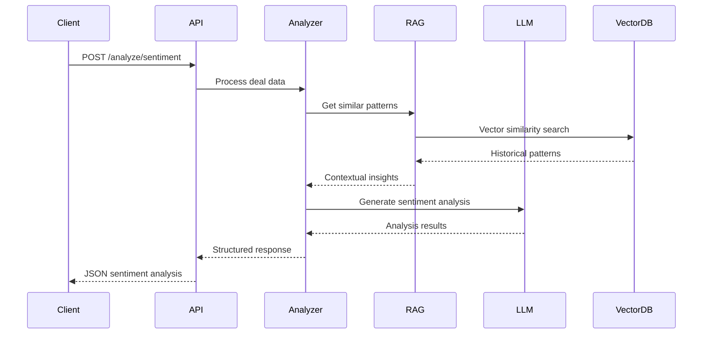
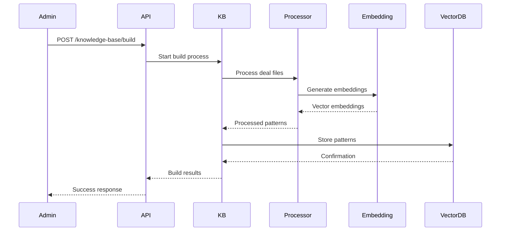

# Sales Sentiment RAG System Architecture

## System Overview

The Sales Sentiment RAG (Retrieval-Augmented Generation) system is a sophisticated AI-powered platform that analyzes salesperson performance and sentiment from CRM activities using historical deal patterns and LLM-powered insights.

## Architecture Diagram

```mermaid
graph TB
    subgraph "Client Layer"
        C[REST API Clients]
        SW[Swagger UI /docs]
        CURL[cURL/Postman Testing]
        WEB[Web Dashboard]
    end
    
    subgraph "API Gateway & Load Balancing"
        LB[FastAPI Server]
        MW[Middleware Stack]
        RL[Rate Limiter]
        AUTH[Authentication]
        LOG[Request Logging]
        ERR[Error Handling]
    end
    
    subgraph "Core Application Services"
        SA[Sentiment Analyzer]
        RAG[RAG Retriever]
        KB[Knowledge Base Manager]
        DP[Data Processor]
        CB[Context Builder]
    end
    
    subgraph "AI/ML Layer"
        LLM[LLM Clients]
        EMB[Embedding Service]
        PROMPT[Prompt Builder]
        
        subgraph "LLM Providers"
            AZURE[Azure OpenAI]
            OAI[OpenAI]
            GROQ[Groq]
            ANTHRO[Anthropic Claude]
        end
        
        subgraph "Embedding Providers"
            ST[Sentence Transformers]
            OAIEMB[OpenAI Embeddings]
            HF[HuggingFace]
        end
    end
    
    subgraph "Data Storage Layer"
        VS[Vector Store]
        CACHE[Redis Cache]
        FS[File System]
        
        subgraph "Vector Databases"
            CHROMA[ChromaDB Local]
            PINECONE[Pinecone Cloud]
        end
    end
    
    subgraph "Data Sources"
        CRM[CRM Systems]
        HUBSPOT[HubSpot]
        SF[Salesforce]
        CSV[CSV Files]
        JSON[JSON Data]
    end
    
    subgraph "Utilities & Monitoring"
        HELPERS[Helper Functions]
        VALID[Data Validation]
        PERF[Performance Monitoring]
        HEALTH[Health Checks]
    end
    
    %% Client Connections
    C --> LB
    SW --> LB
    CURL --> LB
    WEB --> LB
    
    %% API Gateway Flow
    LB --> MW
    MW --> RL
    MW --> AUTH
    MW --> LOG
    MW --> ERR
    MW --> SA
    
    %% Core Service Connections
    SA --> RAG
    SA --> LLM
    SA --> PROMPT
    RAG --> KB
    RAG --> VS
    RAG --> CB
    KB --> DP
    KB --> VS
    DP --> EMB
    
    %% AI/ML Connections
    LLM --> AZURE
    LLM --> OAI
    LLM --> GROQ
    LLM --> ANTHRO
    EMB --> ST
    EMB --> OAIEMB
    EMB --> HF
    
    %% Data Storage Connections
    VS --> CHROMA
    VS --> PINECONE
    SA --> CACHE
    RAG --> CACHE
    KB --> FS
    
    %% Data Source Integration
    DP --> CRM
    DP --> HUBSPOT
    DP --> SF
    DP --> CSV
    DP --> JSON
    
    %% Utility Connections
    SA --> HELPERS
    DP --> VALID
    LB --> HEALTH
    SA --> PERF
    
    %% Styling
    classDef client fill:#e1f5fe,stroke:#01579b,stroke-width:2px
    classDef api fill:#fff3e0,stroke:#e65100,stroke-width:2px
    classDef core fill:#e8f5e8,stroke:#1b5e20,stroke-width:2px
    classDef ai fill:#f3e5f5,stroke:#4a148c,stroke-width:2px
    classDef storage fill:#ffebee,stroke:#b71c1c,stroke-width:2px
    classDef data fill:#f1f8e9,stroke:#33691e,stroke-width:2px
    classDef utils fill:#fce4ec,stroke:#880e4f,stroke-width:2px
    classDef provider fill:#e8eaf6,stroke:#1a237e,stroke-width:2px
    
    class C,SW,CURL,WEB client
    class LB,MW,RL,AUTH,LOG,ERR api
    class SA,RAG,KB,DP,CB core
    class LLM,EMB,PROMPT ai
    class AZURE,OAI,GROQ,ANTHRO,ST,OAIEMB,HF provider
    class VS,CACHE,FS,CHROMA,PINECONE storage
    class CRM,HUBSPOT,SF,CSV,JSON data
    class HELPERS,VALID,PERF,HEALTH utils
```



## Component Details

### 🌐 Client Layer
- **REST API Clients**: External applications consuming the API
- **Swagger UI**: Interactive API documentation at `/docs`
- **Testing Tools**: cURL, Postman for API testing
- **Web Dashboard**: Optional frontend interface

### 🚪 API Gateway & Middleware
- **FastAPI Server**: High-performance async web framework
- **Rate Limiter**: Prevents API abuse (60 calls/min, 1000/hour)
- **Authentication**: Bearer token and API key support
- **Request Logging**: Comprehensive request/response logging
- **Error Handling**: Standardized error responses

### ⚡ Core Application Services
- **Sentiment Analyzer**: Main orchestration service for sentiment analysis
- **RAG Retriever**: Retrieves similar historical deal patterns
- **Knowledge Base Manager**: Manages vector database operations
- **Data Processor**: Processes CRM data into structured formats
- **Context Builder**: Builds intelligent context from similar deals

### 🤖 AI/ML Layer
- **LLM Clients**: Multi-provider LLM integration
  - Azure OpenAI (Recommended for enterprise)
  - OpenAI GPT-4/3.5
  - Groq (Fast inference)
  - Anthropic Claude
- **Embedding Service**: Text-to-vector conversion
  - Sentence Transformers (Local, free)
  - OpenAI text-embedding-3-large
  - HuggingFace models
- **Prompt Builder**: Advanced prompt engineering for salesperson analysis

### 💾 Data Storage Layer
- **Vector Store**: Similarity search and pattern storage
  - ChromaDB (Local development)
  - Pinecone (Production cloud)
- **Redis Cache**: High-performance caching layer
- **File System**: Local data and configuration storage

### 📊 Data Sources
- **CRM Systems**: Salesforce, HubSpot integration
- **File Formats**: JSON, CSV data import
- **Migration Tools**: Data transformation utilities

### 🛠️ Utilities & Monitoring
- **Helper Functions**: Text processing, validation, similarity calculations
- **Performance Monitoring**: Execution time tracking
- **Health Checks**: System status monitoring
- **Data Validation**: Input/output validation

## Data Flow

### 1. Deal Sentiment Analysis Flow


### 2. Knowledge Base Building Flow


## Key Features

### 🎯 Advanced Sentiment Analysis
- **Professional Standards**: Applies strict salesperson evaluation criteria
- **Multi-dimensional Analysis**: Email, call, meeting, note, and task analysis
- **Temporal Patterns**: Analyzes activity trends and momentum
- **Performance Benchmarking**: Compares against successful deal patterns

### 🔍 Intelligent RAG System
- **Business Criteria Filtering**: Filters by deal type, amount, and probability
- **Contextual Similarity**: Finds deals with similar characteristics
- **Historical Insights**: Provides success/failure pattern analysis
- **Adaptive Context**: Prioritizes recent and important activities

### ⚡ High Performance
- **Async Processing**: FastAPI async support
- **Multi-Provider Redundancy**: Multiple LLM and embedding providers
- **Intelligent Caching**: Redis caching for embeddings and results
- **Batch Processing**: Efficient bulk deal analysis

### 🔒 Production Ready
- **Rate Limiting**: Prevents abuse and ensures fair usage
- **Error Handling**: Comprehensive error management
- **Health Monitoring**: System health and performance tracking
- **Authentication**: Secure API access control

## Deployment Architecture

### Development Setup
```
┌─────────────────┐    ┌─────────────────┐    ┌─────────────────┐
│   FastAPI       │    │   ChromaDB      │    │   Local Files   │
│   Port 8000     │────│   Local Vector  │────│   JSON Data     │
│   Single Node   │    │   Storage       │    │   Config        │
└─────────────────┘    └─────────────────┘    └─────────────────┘
```

## Scalability Considerations

### Horizontal Scaling
- Multiple FastAPI instances behind load balancer
- Distributed Redis cache cluster
- Cloud vector database (Pinecone)

### Performance Optimization
- Embedding caching reduces computation costs
- LLM response caching prevents duplicate API calls
- Batch processing for multiple deal analysis
- Async processing for concurrent requests

### Cost Management
- Local embedding models reduce API costs
- Intelligent caching minimizes LLM API usage
- Configurable rate limiting controls usage
- Multiple provider support for cost optimization

This architecture provides a robust, scalable, and production-ready sales sentiment analysis system that can handle enterprise workloads while maintaining high performance and reliability.

### Prerequisites

- Python 3.8+
- Redis (optional, for caching)
- API keys for LLM services (OpenAI, Anthropic, Groq, or Azure)

### Installation

1. **Clone the repository**
```bash
git clone <repository-url>
cd sales_sentiment_rag
```

2. **Install dependencies**
```bash
pip install -r requirements.txt
```

3. **Set up environment variables**
```bash
cp .env.example .env
# Edit .env with your configuration
```

4. **Configure your environment**
```bash
# Core configuration
LLM_PROVIDER=azure                      # or openai, anthropic, groq
EMBEDDING_SERVICE=sentence_transformers # or openai, huggingface
VECTOR_DB=chromadb                      # or pinecone
DATA_PATH=data/final_deal_details.json

# LLM Provider Configuration (choose one)
AZURE_OPENAI_API_KEY=your_azure_key
AZURE_OPENAI_ENDPOINT=your_endpoint
AZURE_OPENAI_DEPLOYMENT_NAME=your_deployment
AZURE_OPENAI_API_VERSION=2025-03-01-preview

# Alternative providers
OPENAI_API_KEY=your_openai_key
ANTHROPIC_API_KEY=your_anthropic_key
GROQ_API_KEY=your_groq_key

# Optional for enhanced functionality
PINECONE_API_KEY=your_pinecone_key
PINECONE_ENVIRONMENT=your_pinecone_env
REDIS_URL=redis://localhost:6379
```

5. **Build the knowledge base**
```bash
python scripts/build_knowledge_base.py
```

6. **Start the API server**
```bash
python -m uvicorn api.main:app --reload --host 0.0.0.0 --port 8000
```

## 🔧 Configuration

### Supported LLM Providers

- **Azure OpenAI** (`azure`) - Recommended for enterprise
- **OpenAI** (`openai`) - GPT-4 and GPT-3.5
- **Anthropic** (`anthropic`) - Claude models
- **Groq** (`groq`) - Fast inference with Llama models

### Supported Embedding Services

- **Sentence Transformers** (`sentence_transformers`) - Local embeddings (default)
- **OpenAI** (`openai`) - text-embedding-3-small/large
- **HuggingFace** (`huggingface`) - Transformer models

### Supported Vector Databases

- **ChromaDB** (`chromadb`) - Local vector database (default)
- **Pinecone** (`pinecone`) - Cloud vector database

## 📊 Usage

### Building Knowledge Base

```bash
# Process deal data and build vector database
python scripts/build_knowledge_base.py
```

### API Usage

**Analyze Deal Sentiment:**
```bash
curl -X POST "http://localhost:8000/api/v1/analyze/deal-sentiment" \
     -H "Content-Type: application/json" \
     -d '{
       "deal_id": "12345",
       "activities": [
         {
           "activity_type": "email",
           "sent_at": "2024-01-15T09:00:00Z",
           "subject": "Proposal follow-up",
           "body": "Following up on our proposal discussion",
           "direction": "outgoing"
         }
       ],
       "metadata": {
         "amount": 50000,
         "dealstage": "proposal",
         "dealtype": "newbusiness"
       }
     }'
```

**Health Check:**
```bash
curl "http://localhost:8000/health"
```

### Python API

```python
from llm.sentiment_analyzer import create_sentiment_analyzer

# Initialize analyzer
analyzer = create_sentiment_analyzer(
    provider_name="azure",
    provider_config={
        'api_key': 'your_azure_key',
        'endpoint': 'your_endpoint',
        'deployment_name': 'your_deployment'
    }
)

# Analyze deal sentiment
deal_data = {
    'deal_id': '12345',
    'activities': [...],  # List of activity dictionaries
    'metadata': {...}     # Deal metadata
}

result = analyzer.analyze_deal_sentiment(deal_data)
print(f"Sentiment Score: {result['sentiment_score']}")
print(f"Overall Sentiment: {result['overall_sentiment']}")
print(f"Risk Level: {result['risk_assessment']['risk_level']}")
```

## 🧪 Testing

### Run System Tests
```bash
python scripts/test_system.py
```

### Run Unit Tests
```bash
pytest tests/ -v
```

### Test Individual Components
```bash
# Test embeddings
python -m core.embedding_service

# Test vector store
python -m core.vector_store

# Test data processor
python -m core.data_processor
```

## 📈 Features

### Core Capabilities

- **Deal Activity Processing**: Extracts and processes sales activities (emails, calls, meetings, notes, tasks)
- **Similarity Search**: Finds similar historical deals and patterns using vector embeddings
- **Sentiment Analysis**: Evaluates salesperson performance using advanced LLM prompts
- **RAG Context**: Provides intelligent context from historical successful/failed deals
- **Performance Metrics**: Tracks response times, activity frequency, and engagement patterns

### Analysis Features

- **Sentiment Scoring**: Numerical sentiment scores from -1.0 to +1.0
- **Risk Assessment**: Identifies deal risks and behavioral patterns
- **Coaching Recommendations**: Provides actionable improvement suggestions
- **Performance Benchmarking**: Compares against successful deal patterns
- **Activity Breakdown**: Detailed analysis of email, call, meeting, and task activities

### Technical Features

- **Multi-Provider LLM Support**: Works with Azure OpenAI, OpenAI, Anthropic, Groq
- **Flexible Embeddings**: Support for local and cloud embedding services
- **Vector Database Options**: ChromaDB for local, Pinecone for cloud
- **Optional Redis Caching**: High-performance caching for embeddings and results
- **Comprehensive Logging**: Structured logging for debugging and monitoring

## 🛠️ Data Migration

### HubSpot Integration
```bash
# Migrate HubSpot CRM export to standard format
python scripts/migrate_data.py hubspot-to-standard \
    --input data/hubspot_export.json \
    --output data/final_deal_details.json
```

### Custom Data Format
```bash
# Convert custom CRM format
python scripts/migrate_data.py custom-format \
    --input data/custom_deals.csv \
    --output data/final_deal_details.json
```

## 🚀 Deployment

### Local Development
```bash
# Install dependencies
pip install -r requirements.txt

# Set environment variables
export LLM_PROVIDER=azure
export EMBEDDING_SERVICE=sentence_transformers
export VECTOR_DB=chromadb

# Run development server
python -m uvicorn api.main:app --reload
```

### Production Deployment
```bash
# Run with gunicorn
pip install gunicorn
gunicorn api.main:app -w 4 -k uvicorn.workers.UvicornWorker --bind 0.0.0.0:8000
```

## 📋 API Endpoints

| Endpoint | Method | Description |
|----------|--------|-------------|
| `/health` | GET | System health check |
| `/api/v1/analyze/deal-sentiment` | POST | Analyze deal sentiment |
| `/api/v1/search/similar-deals` | POST | Find similar deals |
| `/api/v1/knowledge-base/build` | POST | Rebuild knowledge base |
| `/api/v1/knowledge-base/stats` | GET | Knowledge base statistics |

## 🔍 Monitoring

### Logging
- Structured JSON logging with configurable levels
- Component-specific loggers for debugging
- Performance metrics tracking
- Error tracking and alerting

### Health Checks
- Service availability monitoring
- Database connection health
- Vector database status
- LLM provider connectivity

## 🆘 Troubleshooting

### Common Issues

**Knowledge Base Build Fails:**
```bash
# Check data file exists and is valid JSON
python -m json.tool data/final_deal_details.json

# Check logs for specific errors
tail -f logs/app.log
```

**LLM Provider Issues:**
```bash
# Test Azure OpenAI connection
python -c "
from llm.llm_clients import create_llm_client
client = create_llm_client('azure')
print('Connection successful')
"
```

**Vector Database Issues:**
```bash
# For ChromaDB - check disk space
df -h data/vector_db/

# For Pinecone - verify API key
python -c "
import pinecone
pinecone.init(api_key='your-key')
print('Pinecone connection successful')
"
```

### Performance Optimization

- Use Redis caching for better performance
- Consider Pinecone for production vector storage
- Monitor memory usage with large embedding models
- Use Azure OpenAI for enterprise-grade reliability

## 📚 Environment Variables Reference

### Required Variables
```bash
LLM_PROVIDER=azure                      # LLM service provider
EMBEDDING_SERVICE=sentence_transformers # Embedding service
VECTOR_DB=chromadb                      # Vector database
DATA_PATH=data/final_deal_details.json  # Deal data file path
```

### LLM Provider Keys (choose one)
```bash
# Azure OpenAI (recommended)
AZURE_OPENAI_API_KEY=your_key
AZURE_OPENAI_ENDPOINT=your_endpoint
AZURE_OPENAI_DEPLOYMENT_NAME=your_deployment

# OpenAI
OPENAI_API_KEY=your_openai_key

# Anthropic
ANTHROPIC_API_KEY=your_anthropic_key

# Groq
GROQ_API_KEY=your_groq_key
```

### Optional Variables
```bash
PINECONE_API_KEY=your_pinecone_key      # For Pinecone vector DB
REDIS_URL=redis://localhost:6379        # For caching
LOG_LEVEL=INFO                          # Logging level
API_PORT=8000                           # API server port
```

---