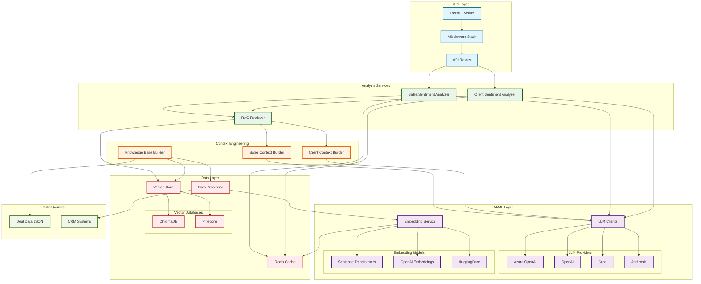
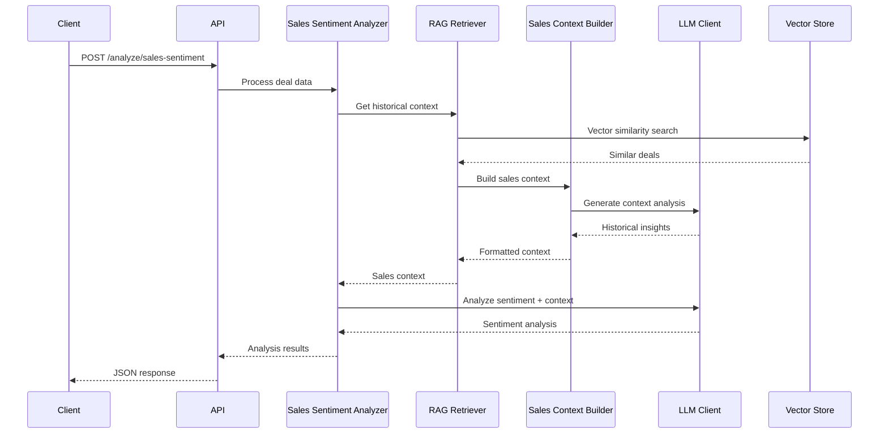
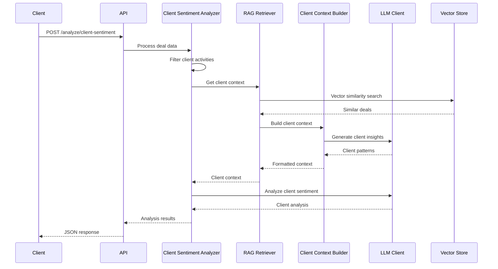
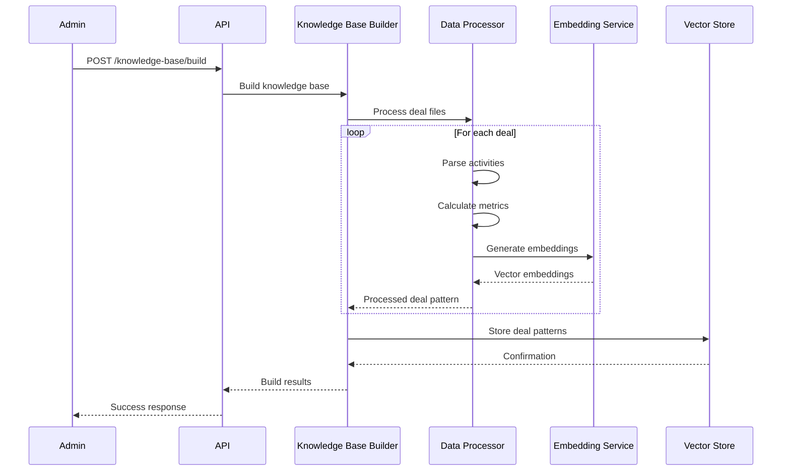

# Sales Sentiment RAG API

## Overview

The Sales Sentiment RAG API is an advanced AI-powered system that analyzes both **salesperson performance** and **client engagement** from CRM activities using Retrieval-Augmented Generation (RAG) and Large Language Models (LLMs). The system provides intelligent sentiment analysis by leveraging historical deal patterns to provide context-aware insights.

## 🏗️ System Architecture



## 🔄 Analysis Workflow

### 1. Sales Sentiment Analysis Flow



### 2. Client Sentiment Analysis Flow



### 3. Knowledge Base Building Flow



## 🎯 Key Features

### 📊 Dual Sentiment Analysis
- **Sales Sentiment**: Analyzes salesperson performance, communication effectiveness, and deal management
- **Client Sentiment**: Evaluates client engagement, buying intent, and decision readiness
- **Strict Professional Standards**: Applies realistic evaluation criteria for sales professionals

### 🧠 Intelligent Context Engineering
- **Sales Context Builder**: Generates insights from successful/failed sales patterns
- **Client Context Builder**: Analyzes client engagement patterns and buying signals
- **LLM-Powered Context**: Uses dedicated prompts for contextual analysis

### 🔍 Advanced RAG System
- **Vector Similarity Search**: Finds relevant historical deals using embeddings
- **Business Criteria Filtering**: Filters by deal amount, stage, type, and outcome
- **Adaptive Context**: Prioritizes recent and high-priority activities

### 🤖 Multi-Provider AI Support
- **LLM Providers**: Azure OpenAI, OpenAI, Anthropic, Groq
- **Embedding Services**: Sentence Transformers, OpenAI, HuggingFace
- **Vector Databases**: ChromaDB (local), Pinecone (cloud)

## 🚀 Quick Start

### Prerequisites
- Python 3.8+
- Redis (optional, for caching)
- API keys for LLM providers

### Installation

```bash
# Clone repository
git clone <repository-url>
cd sales_sentiment_rag

# Install dependencies
pip install -r requirements.txt

# Set up environment
cp .env.example .env
# Edit .env with your configuration
```

### Configuration

```bash
# Core settings
LLM_PROVIDER=azure                      # or openai, anthropic, groq
EMBEDDING_SERVICE=sentence_transformers # or openai, huggingface
VECTOR_DB=chromadb                      # or pinecone
DATA_PATH=data/final_deal_details.json

# Azure OpenAI (recommended)
AZURE_OPENAI_API_KEY=your_azure_key
AZURE_OPENAI_ENDPOINT=your_endpoint
AZURE_OPENAI_DEPLOYMENT_NAME=your_deployment

# Optional enhancements
REDIS_URL=redis://localhost:6379
PINECONE_API_KEY=your_pinecone_key
```

### Build Knowledge Base

```bash
# Process deal data and build vector database
python -c "
from rag.knowledge_base import create_knowledge_base_builder
kb_builder = create_knowledge_base_builder()
result = kb_builder.build_knowledge_base('data/final_deal_details.json')
print(f'Built knowledge base: {result}')
"
```

### Start API Server

```bash
# Development
python -m uvicorn api.main:app --reload --port 8000

# Production
gunicorn api.main:app -w 4 -k uvicorn.workers.UvicornWorker --bind 0.0.0.0:8000
```

## 📡 API Endpoints

### Sales Analysis
- `POST /api/v1/analyze/sales-sentiment` - Analyze salesperson sentiment
- `POST /api/v1/analyze/sales-batch` - Batch sales sentiment analysis

### Client Analysis
- `POST /api/v1/analyze/client-sentiment` - Analyze client engagement
- `POST /api/v1/analyze/client-batch` - Batch client sentiment analysis

### Knowledge Base
- `POST /api/v1/knowledge-base/build` - Build knowledge base
- `GET /api/v1/knowledge-base/status` - Get knowledge base status
- `DELETE /api/v1/knowledge-base/clear` - Clear knowledge base

### System
- `GET /health` - Health check
- `GET /api/v1/system/stats` - System statistics
- `POST /api/v1/search` - Search knowledge base

## 💡 Usage Examples

### Sales Sentiment Analysis

```bash
curl -X POST "http://localhost:8000/api/v1/analyze/sales-sentiment" \
  -H "Content-Type: application/json" \
  -d '{
    "deal_data": {
      "deal_id": "12345",
      "activities": [
        {
          "activity_type": "email",
          "sent_at": "2024-01-15T09:00:00Z",
          "subject": "Proposal Follow-up",
          "body": "Thank you for your feedback. I have revised the proposal based on your requirements.",
          "direction": "outgoing"
        }
      ],
      "amount": "50000",
      "dealstage": "Proposal",
      "dealtype": "newbusiness",
      "deal_stage_probability": "0.75"
    },
    "include_rag_context": true
  }'
```

### Client Sentiment Analysis

```bash
curl -X POST "http://localhost:8000/api/v1/analyze/client-sentiment" \
  -H "Content-Type: application/json" \
  -d '{
    "deal_data": {
      "deal_id": "12345",
      "activities": [
        {
          "activity_type": "email",
          "sent_at": "2024-01-15T10:00:00Z",
          "subject": "RE: Proposal Discussion",
          "body": "Thanks for the proposal. We have some questions about implementation timeline.",
          "direction": "incoming"
        }
      ],
      "amount": "50000",
      "dealstage": "Proposal",
      "dealtype": "newbusiness"
    },
    "include_rag_context": true
  }'
```

### Python SDK Usage

```python
from llm.sales_sentiment_analyzer import create_sales_sentiment_analyzer
from llm.client_sentiment_analyzer import create_client_sentiment_analyzer

# Initialize analyzers
sales_analyzer = create_sales_sentiment_analyzer()
client_analyzer = create_client_sentiment_analyzer()

# Analyze deal
deal_data = {
    'deal_id': '12345',
    'activities': [...],
    'amount': '50000',
    'dealstage': 'Proposal',
    'dealtype': 'newbusiness'
}

# Sales analysis
sales_result = sales_analyzer.analyze_deal_sentiment(deal_data)
print(f"Sales Sentiment: {sales_result['overall_sentiment']}")
print(f"Sales Score: {sales_result['sentiment_score']}")

# Client analysis
client_result = client_analyzer.analyze_client_sentiment(deal_data)
print(f"Client Sentiment: {client_result['overall_sentiment']}")
print(f"Client Score: {client_result['sentiment_score']}")
```

## 🔧 Data Processing Pipeline

### 1. Deal Data Structure
```json
{
  "deal_id": "12345",
  "activities": [
    {
      "activity_type": "email",
      "sent_at": "2024-01-15T09:00:00Z",
      "subject": "Follow-up",
      "body": "Thank you for the meeting...",
      "direction": "outgoing"
    },
    {
      "activity_type": "call",
      "createdate": "2024-01-16T14:30:00Z",
      "call_title": "Client Discussion",
      "call_body": "Discussed next steps...",
      "call_direction": "OUTBOUND"
    }
  ],
  "amount": "50000",
  "dealstage": "Proposal",
  "dealtype": "newbusiness",
  "deal_stage_probability": "0.75"
}
```

### 2. Activity Processing
- **Email**: Subject + Body analysis
- **Call**: Title + Notes analysis
- **Meeting**: Title + Internal notes
- **Note**: Note body content
- **Task**: Subject + Task details

### 3. Context Engineering
- **Sales Context**: Focuses on salesperson performance patterns
- **Client Context**: Analyzes client engagement and buying signals
- **Historical Patterns**: Retrieves similar deals for context

## 🎯 Analysis Outputs

### Sales Sentiment Response
```json
{
  "overall_sentiment": "positive",
  "sentiment_score": 0.65,
  "confidence": 0.85,
  "activity_breakdown": {
    "email": {
      "sentiment": "positive",
      "sentiment_score": 0.7,
      "key_indicators": ["Strategic follow-up", "Value proposition"],
      "count": 3
    }
  },
  "deal_momentum_indicators": {
    "stage_progression": "advancing",
    "client_engagement_trend": "increasing",
    "competitive_position": "strengthening"
  },
  "reasoning": "Salesperson demonstrates proactive engagement...",
  "recommended_actions": ["Continue current approach", "Schedule follow-up"]
}
```

### Client Sentiment Response
```json
{
  "overall_sentiment": "positive",
  "sentiment_score": 0.72,
  "confidence": 0.88,
  "client_engagement_indicators": {
    "response_pattern": "quick",
    "initiative_level": "proactive",
    "decision_readiness": "evaluating"
  },
  "buying_signals": ["Asking detailed questions", "Requesting timeline"],
  "concern_indicators": ["Budget constraints mentioned"],
  "decision_timeline": "near_term",
  "client_risk_level": "low"
}
```

## 🏗️ Technical Implementation

### Core Components

#### 1. **LLM Clients** (`llm/llm_clients.py`)
- Multi-provider support (Azure OpenAI, OpenAI, Anthropic, Groq)
- Provider-specific response handling
- Prompt template management
- Response validation and parsing

#### 2. **Sentiment Analyzers**
- **Sales Analyzer** (`llm/sales_sentiment_analyzer.py`): Salesperson performance
- **Client Analyzer** (`llm/client_sentiment_analyzer.py`): Client engagement
- RAG context integration
- Batch processing support

#### 3. **Context Engineering**
- **Sales Context Builder** (`rag/sales_context_builder.py`): Sales patterns
- **Client Context Builder** (`rag/client_context_builder.py`): Client patterns
- LLM-powered context generation
- Historical pattern analysis

#### 4. **RAG System** (`rag/retriever.py`)
- Vector similarity search
- Deal relevance scoring
- Context type routing (sales/client)
- Metadata filtering

#### 5. **Data Processing** (`core/data_processor.py`)
- Activity parsing and normalization
- Deal metrics calculation
- Embedding generation
- Structured data extraction

### Specialized Features

#### Adaptive Context Analysis
- **Priority Weighting**: Recent activities weighted at 60%
- **Pattern Recognition**: Identifies critical pattern changes
- **Stage-Specific Context**: Adapts to deal stage requirements
- **Intelligent Filtering**: Relevance-based deal matching

#### Professional Standards
- **Salesperson Evaluation**: Strict professional criteria
- **Client Filtering**: Focuses on client-initiated activities
- **Outcome Correlation**: Links activities to deal success
- **Benchmarking**: Compares against successful patterns

## 🚀 Production Features

### Performance & Reliability
- **Async Processing**: FastAPI async support
- **Intelligent Caching**: Redis-based embedding and response caching
- **Batch Processing**: Efficient multi-deal analysis
- **Error Handling**: Comprehensive error management

### Security & Control
- **Rate Limiting**: Configurable request limits
- **Authentication**: API key and bearer token support
- **Input Validation**: Pydantic model validation
- **Audit Logging**: Comprehensive request/response logging

### Monitoring & Observability
- **Health Checks**: Service health monitoring
- **Performance Metrics**: Response time tracking
- **System Statistics**: Usage and performance stats
- **Structured Logging**: JSON-formatted logs

## 🔧 Configuration

### Environment Variables
```bash
# Core Configuration
LLM_PROVIDER=azure                      # LLM service provider
EMBEDDING_SERVICE=sentence_transformers # Embedding service
VECTOR_DB=chromadb                      # Vector database
DATA_PATH=data/final_deal_details.json  # Deal data file

# Azure OpenAI
AZURE_OPENAI_API_KEY=your_key
AZURE_OPENAI_ENDPOINT=your_endpoint
AZURE_OPENAI_DEPLOYMENT_NAME=your_deployment

# Optional Services
REDIS_URL=redis://localhost:6379        # For caching
PINECONE_API_KEY=your_key              # For cloud vector DB
API_PORT=8000                          # Server port
LOG_LEVEL=INFO                         # Logging level
```

### Supported Providers
- **LLM**: Azure OpenAI, OpenAI, Anthropic, Groq
- **Embeddings**: Sentence Transformers, OpenAI, HuggingFace
- **Vector DB**: ChromaDB (local), Pinecone (cloud)
- **Cache**: Redis (optional)

## 📚 API Documentation

Interactive API documentation is available at:
- **Swagger UI**: `http://localhost:8000/docs`
- **ReDoc**: `http://localhost:8000/redoc`
- **OpenAPI JSON**: `http://localhost:8000/openapi.json`

## 🧪 Testing

```bash
# System test
python scripts/test_system.py

# Unit tests
pytest tests/ -v

# Health check
curl http://localhost:8000/health
```

## 🎯 Use Cases

### Sales Team Performance
- **Individual Assessment**: Analyze salesperson effectiveness
- **Team Benchmarking**: Compare against successful patterns
- **Coaching Insights**: Identify improvement opportunities
- **Performance Tracking**: Monitor sentiment trends over time

### Client Engagement Optimization
- **Buying Intent**: Assess client readiness to purchase
- **Engagement Quality**: Evaluate client interaction depth
- **Risk Assessment**: Identify deal risks early
- **Timeline Prediction**: Predict decision timelines

### Deal Pipeline Management
- **Deal Scoring**: Prioritize deals by sentiment scores
- **Pattern Recognition**: Identify successful deal patterns
- **Early Warning**: Detect potential deal issues
- **Strategic Insights**: Optimize sales processes

## 🔄 Deployment Options

### Development
```bash
python -m uvicorn api.main:app --reload --port 8000
```

### Production
```bash
gunicorn api.main:app -w 4 -k uvicorn.workers.UvicornWorker --bind 0.0.0.0:8000
```

### Docker (Optional)
```dockerfile
FROM python:3.9-slim
WORKDIR /app
COPY requirements.txt .
RUN pip install -r requirements.txt
COPY . .
CMD ["gunicorn", "api.main:app", "-w", "4", "-k", "uvicorn.workers.UvicornWorker", "--bind", "0.0.0.0:8000"]
```

---

## 📝 License

MIT License - see LICENSE file for details.

## 🤝 Contributing

1. Fork the repository
2. Create feature branch
3. Commit changes
4. Push to branch
5. Create Pull Request

## 📧 Support

For support and questions:
- Email: support@company.com
- Documentation: `/docs`
- Health Check: `/health`